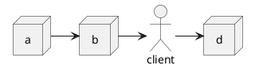

## Markdown Example

You can embed PlantUML diagrams in Markdown.

```plantuml
@startuml example
actor client
node a
node b
node d

a -> b
b -> client
client -> d
@enduml
```

*Note:* When using preview in VS Code make sure to allow insecure sources in preview popup.